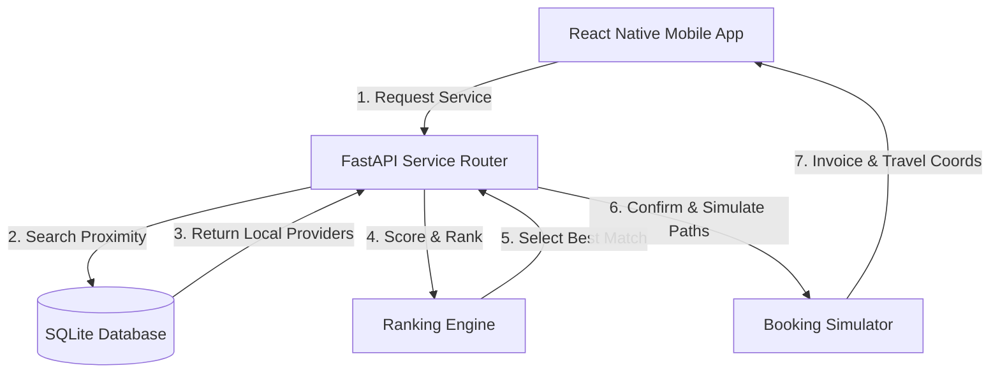

# اہلِ فن (Ahle Fun) — Local Artisan & Home Service Booking Platform

<p align="center">
  
</p>

<p align="center">
  <strong>Ahle Fun (اہلِ فن)</strong> translates to <em>"People of Art & Craft"</em>. It is a modern, hyper-local home service booking platform designed to connect users with highly skilled local artisans (plumbers, electricians, mechanics, painters, and other professionals) instantly and reliably.
</p>

---

## 🌟 Key Features

### 📍 Proximity & Location-Based Discovery
- **Auto-GPS Resolution**: The application automatically retrieves the user's current GPS coordinates to search for nearby service providers.
- **Dynamic Radius Matching**: Finds the closest active artisans and filters them based on service category (e.g., plumbing, electrical works, home repair).

### 💳 Transparent Booking & Invoice Generation
- **Simulated Reservation Engine**: Generates a real-time booking confirmation with an order number, final service quote, and estimated time of arrival (ETA).
- **Service Summary**: Visualized invoices listing call-out fees, labor rates, and total estimated billing before the work begins.

### 📡 Live Tracking & Interactive Map Paths
- **Visual Travel Tracking**: Watch the provider's progress on an interactive map. Features realistic coordinate interpolation representing the travel path of the artisan to the customer's location.
- **Status Updates**: Real-time status transitions (e.g., *Requested*, *Artisan Dispatched*, *Arrived*, *In Progress*, *Completed*).

### 💬 Direct Provider Communication
- **Interactive Chat Interface**: A dedicated communication channel connecting users and artisans to share details, project instructions, or coordinates directly.

### 🔔 Smart Reminders & Local Notifications
- **Push Alerts**: Receives immediate local push notifications on reservation confirmation and reminders for upcoming scheduled tasks.

---

## 🏗️ System Architecture

Ahle Fun is built using a decoupled architecture, dividing responsibilities between a Python FastAPI backend and a cross-platform React Native Expo mobile client.



1. **Service Router**: Receives service category, schedule slot, and coordinates from the mobile client.
2. **Geographical Filter**: Filters the database to isolate artisans working within the requested city or district coordinates.
3. **Ranking Engine**: Selects the best provider using a balanced scoring formula based on current rating, proximity (distance), and relative pricing.
4. **Booking Simulator**: Books the selected provider, logs the event in the database, and schedules push notification alerts.

---

## 🛠️ Folder Structure & Tech Stack

```
Antigravity-Hackathon/
├── backend/            # FastAPI Backend
│   ├── app/
│   │   ├── main.py     # Application entrypoint exposing REST API routes
│   │   ├── database.py # SQLite database setup & connection pool management
│   │   ├── models/     # Database models & Pydantic validation schemas
│   │   └── mock_data/  # Pre-seeded local artisan database profiles
│   └── DEPLOYMENT.md   # Deployment instructions for production hosting
├── mobile/             # Expo React Native App
│   ├── src/
│   │   ├── screens/    # Onboarding, HomeScreen, BookingScreen, ResultsScreen, TrackingScreen, ProviderChatScreen
│   │   ├── components/ # Shared UI layouts, SidePanel, RatingModal
│   │   └── config.js   # Client configuration (API endpoints & constants)
│   ├── app.json        # Expo configuration (icons, splash screen, package metadata)
│   └── App.js          # Navigation container setup
└── assets/             # Brand logos and promotional graphic assets
```

---

## 🚀 Local Setup & Installation

### 1. Backend Setup (FastAPI)

1. Navigate to the backend directory:
   ```bash
   cd backend
   ```
2. Create and activate a Python virtual environment:
   ```bash
   python -m venv venv
   source venv/bin/activate  # On Windows: .\venv\Scripts\activate
   ```
3. Install the required Python dependencies:
   ```bash
   pip install -r requirements.txt
   ```
4. Start the FastAPI development server:
   ```bash
   uvicorn app.main:app --reload
   ```
   The API will be available locally at `http://localhost:8000`. You can test endpoints and view the interactive documentation at `http://localhost:8000/docs`.

---

### 2. Mobile Client Setup (Expo SDK 54)

1. Navigate to the mobile directory:
   ```bash
   cd mobile
   ```
2. Install the node package dependencies:
   ```bash
   npm install
   ```
3. Start the Expo CLI development server:
   ```bash
   npm run start
   ```
4. Load the application on your device or simulator:
   - Press `a` to open in an Android Emulator.
   - Press `i` to open in an iOS Simulator.
   - Scan the QR code using the Expo Go mobile app (available on App Store and Google Play).

---

## 📦 Cloud Builds (EAS Build)

The mobile client is pre-configured to build into standalone binaries (e.g. preview APKs) using **EAS Build** (Expo Application Services).

To trigger a preview Android build:
```bash
cd mobile
eas build --platform android --profile preview
```

---
<p align="center">
  Crafted with ❤️ by the Ahle Fun Team during the Antigravity Hackathon.
</p>
