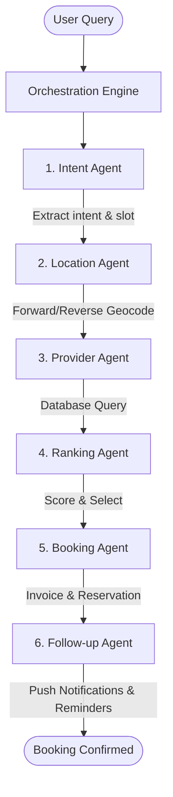

# اہلِ فن (Ahle Fun) — AI-Driven Local Artisan & Home Service Booking Platform

<p align="center">
  
</p>

<p align="center">
  <strong>Ahle Fun (اہلِ فن)</strong> translates to <em>"People of Art & Craft"</em>. It is an agentic, AI-driven, hyper-local home service booking platform designed to connect users with highly skilled local artisans (plumbers, electricians, mechanics, painters, and other professionals) using natural language conversational prompts.
</p>

---

## 🌟 Key Features

### 🧠 Agentic Service Orchestration
Instead of filling out tedious filters and forms, users simply describe their requirements in plain text (e.g., *"My kitchen sink is leaking and I need a plumber in Johar Town around 5 PM"*). The backend coordinate system spins up specialized AI agents to process the query, resolve coordinates, search providers, rank them, and finalize the booking.

### 📍 Smart Location & Geocoding
- **Auto-GPS Resolution**: If the user doesn't mention a location, the **Location Agent** reverse-geocodes their current live GPS coordinates to determine the target area.
- **Book-for-Others Mode**: Users can book services for relatives or friends at a different address. The Location Agent automatically forward-geocodes the text address into precise GPS coordinates to discover local providers near that address.

### 📡 Live Tracking & Interactive Reasoning
- **Reasoning Screen**: The mobile client features a dedicated reasoning layout that displays the live step-by-step logic and outputs of each AI agent in the pipeline, offering full transparency.
- **Interactive Provider Chat**: Connect with selected artisans through real-time communication.
- **Visual Live Tracking**: Watch the provider's progress on an interactive map using realistic visual paths.

---

## 🏗️ System Architecture

Ahle Fun is designed with a decoupled architecture containing a Python FastAPI orchestrator and a React Native Expo mobile client.

### Multi-Agent Pipeline Workflow



1. **Intent Agent**: Uses LLM completion to parse the request, extracting the service type, time slot, budget range, and specified location.
2. **Location Agent**: Performs address resolution. Utilizes Google Maps/Geocoding API to resolve coordinates.
3. **Provider Agent**: Discovers matching service providers in the SQLite database (`antigravity.db`) within the target location area.
4. **Ranking Agent**: Automatically scores and ranks matching providers using a combination of rating, price, and proximity.
5. **Booking Agent**: Creates a simulation record containing order number, final quote, and estimated time of arrival (ETA).
6. **Follow-Up Agent**: Sets up push notifications and scheduled reminders (via Expo Notifications) based on the target execution time (immediate vs scheduled).

---

## 🛠️ Tech Stack & Folder Structure

```
Antigravity-Hackathon/
├── backend/            # FastAPI Backend & Multi-Agent System
│   ├── app/
│   │   ├── agents/     # LLM Agents (Intent, Discovery, Ranking, Booking, Follow-up)
│   │   ├── models/     # Pydantic schemas and database models
│   │   ├── main.py     # Entrypoint exposing REST endpoints
│   │   └── database.py # SQLite database configurations
│   └── DEPLOYMENT.md   # Production deployment guidelines for Render
├── mobile/             # Expo React Native Cross-Platform Application
│   ├── src/
│   │   ├── screens/    # Onboarding, HomeScreen, ReasoningScreen, TrackingScreen, ProviderChatScreen
│   │   ├── components/ # Custom layouts, SidePanel, RatingModal
│   │   └── config.js   # API endpoint and keys configs
│   ├── eas.json        # Expo Application Services Build settings
│   └── App.js          # Main app navigation container
└── assets/             # Brand logos and promotional assets
```

---

## 🚀 Setup & Installation

### Backend Setup (FastAPI)

1. Navigate to the backend directory:
   ```bash
   cd backend
   ```
2. Create and activate a Python virtual environment:
   ```bash
   python -m venv venv
   source venv/bin/activate  # On Windows: .\venv\Scripts\activate
   ```
3. Install the dependencies:
   ```bash
   pip install -r requirements.txt
   ```
4. Create a `.env` file in the `backend/` directory with your API keys:
   ```env
   GROQ_API_KEY=your_groq_api_key
   GEMINI_API_KEY=your_gemini_api_key
   ```
5. Run the FastAPI development server:
   ```bash
   uvicorn app.main:app --reload
   ```
   The API will be available at `http://localhost:8000`. You can inspect the Swagger UI documentation at `http://localhost:8000/docs`.

---

### Mobile Client Setup (Expo SDK 54)

1. Navigate to the mobile directory:
   ```bash
   cd mobile
   ```
2. Install the node dependencies:
   ```bash
   npm install
   ```
3. Create a `.env` file in the `mobile/` directory:
   ```env
   EXPO_PUBLIC_GEMINI_API_KEY=your_gemini_api_key
   EXPO_PUBLIC_GROQ_API_KEY=your_groq_api_key
   ```
4. Start the Expo development server:
   ```bash
   npm run start
   ```
5. Press `a` to open in an Android Emulator, `i` for iOS Simulator, or scan the QR code using the Expo Go app.

---

## 📦 Cloud Build Pipeline (EAS Build)

To build the application for production or preview distribution (APK), the project is configured with **EAS Build**. 

### Native Compilation Patch
Because Expo SDK 54 / `react-native` templates can occasionally reference newer, uncached Gradle versions (e.g., `8.14.3`), the EAS build servers would sometimes experience build crashes due to missing network downloads. 

We solved this with a automated patch system:
1. **`postinstall.js`**: Patches the `@react-native/gradle-plugin` to point to the official, cached Gradle version `8.8`.
2. **`patch-gradle-after-prebuild.js`**: Automatically run during the `eas-build-post-install` lifecycle hook to patch the generated `android/gradle/wrapper/gradle-wrapper.properties` directly inside the cloud container.
This ensures Gradle compiles instantaneously and without errors on remote EAS workers.

To build the preview APK:
```bash
cd mobile
eas build --platform android --profile preview
```

---
<p align="center">
  Crafted with ❤️ by the Ahle Fun Team during the Antigravity Hackathon.
</p>
